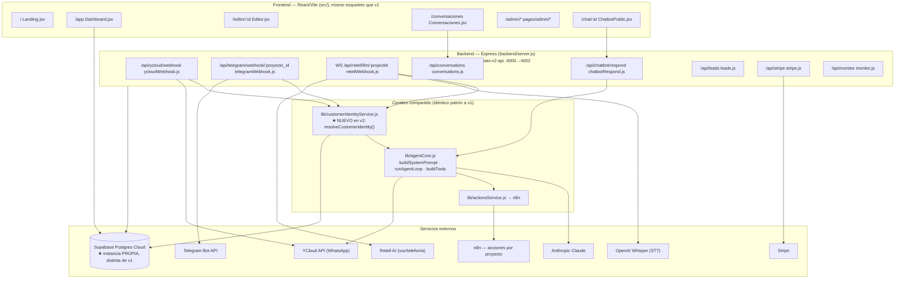
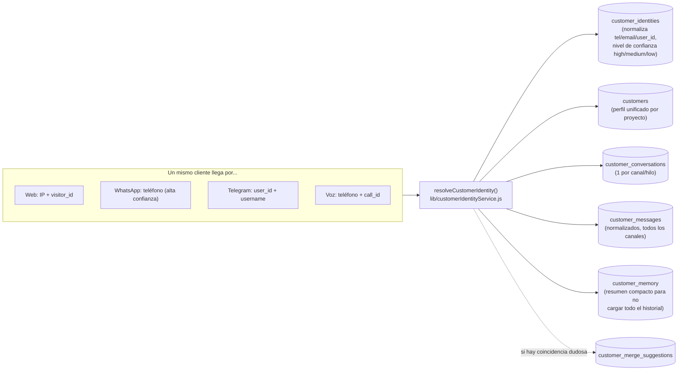
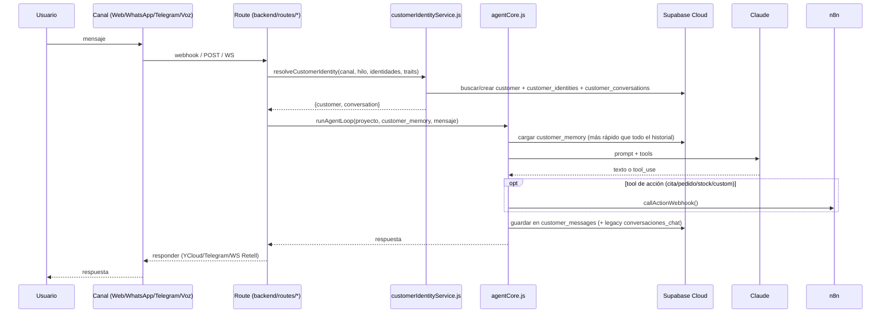
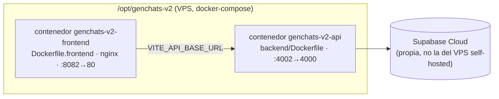

# GenChats v2 — Grafo de arquitectura y procesos

> Repo/deploy **independiente** de la producción actual (`/Users/lmllamas/Desktop/genchats`, ver su
> [`GRAFO_ARQUITECTURA.md`](../GRAFO_ARQUITECTURA.md)). Es una reescritura/evolución del mismo backend
> Express + agentCore, con BD Cloud propia y una capa nueva de **identidad omnicanal**.
>
> ⚠️ `PROYECTO.md` de esta carpeta parece una copia sin actualizar del de v1 (menciona "Easypanel"; el
> despliegue real es docker-compose en `/opt/genchats-v2`, ver sección 5). Para infraestructura/despliegue
> fiate de este documento, no de `PROYECTO.md`.

## 1. Mapa de componentes

## 2. La pieza nueva: identidad omnicanal (no existe en v1)

**Por qué importa:** en v1, cada canal guarda su propio rastro (`mensajes_wa`, `conversaciones_chat`) sin
enlazar "esta persona por WhatsApp" con "esta misma persona que llamó por teléfono". En v2, `resolveCustomerIdentity()`
unifica todo bajo un único `customer` por proyecto, con las tablas legacy (`proyectos`, `leads`, `mensajes_wa`,
`conversaciones_chat`) **coexistiendo** para compatibilidad.

## 3. Flujo de un mensaje entrante (igual que v1 + paso de identidad)

## 4. Índice de procesos → archivos

| Proceso de negocio | Dónde tocar |
|---|---|
| Resolución de identidad omnicanal (★ solo v2) | [`backend/lib/customerIdentityService.js`](backend/lib/customerIdentityService.js) |
| Esquema de identidad omnicanal (migración) | [`supabase/migrations/004_omnichannel_identity.sql`](supabase/migrations/004_omnichannel_identity.sql) |
| Lógica del agente / prompt / bucle de herramientas | [`backend/lib/agentCore.js`](backend/lib/agentCore.js) |
| Herramientas de acción (citas, pedidos, stock, custom) → n8n | [`backend/lib/actionsService.js`](backend/lib/actionsService.js) |
| Webhook WhatsApp (YCloud) | [`backend/routes/ycloudWebhook.js`](backend/routes/ycloudWebhook.js) |
| Webhook Telegram | [`backend/routes/telegramWebhook.js`](backend/routes/telegramWebhook.js) |
| Voz / teléfono (Retell Custom LLM WS) | [`backend/routes/retellWebhook.js`](backend/routes/retellWebhook.js) — prompt telefónico en `buildPhoneSystemPrompt()` |
| Widget web (autenticado / público) | [`backend/routes/chatbotRespond.js`](backend/routes/chatbotRespond.js), [`src/pages/ChatbotPublic.jsx`](src/pages/ChatbotPublic.jsx) |
| CRM de leads / conversaciones | [`backend/routes/leads.js`](backend/routes/leads.js), [`backend/routes/conversations.js`](backend/routes/conversations.js) |
| Pagos Stripe | [`backend/routes/stripe.js`](backend/routes/stripe.js) |
| Panel admin (`lmllamas@gmail.com` únicamente) | [`backend/routes/admin.js`](backend/routes/admin.js), [`src/pages/admin/*`](src/pages/admin/) |
| Configurar herramientas n8n por proyecto (UI) | [`src/components/admin/ToolsProjectSection.jsx`](src/components/admin/ToolsProjectSection.jsx) |
| Auth (frontend) | [`src/lib/AuthContext.jsx`](src/lib/AuthContext.jsx) |
| Despliegue | [`docker-compose.production.yml`](docker-compose.production.yml) en `/opt/genchats-v2` del VPS — servicios `api` (puerto 4002→4000) y `frontend` (puerto 8082→80, nginx) |

## 5. Despliegue (real, no confundir con `PROYECTO.md`)

Variables clave: `backend/.env.production` (Supabase Cloud, N8N_ACTIONS_WEBHOOK_URL, YCLOUD_API_KEY,
STRIPE_SECRET_KEY, ANTHROPIC_API_KEY) y `.env.production` del frontend (`VITE_API_BASE_URL` apuntando a `:4002`).

## 6. Tablas Supabase Cloud (propias de v2)

**Legacy (compatibilidad con v1):** `proyectos` · `leads` · `mensajes_wa` · `conversaciones_chat` · `config_plataforma` · `config_global` · `user_profiles` · `project_tools`

**Nuevas — identidad omnicanal:** `customers` · `customer_identities` · `customer_conversations` · `customer_messages` · `customer_memory` · `customer_merge_suggestions` · `customer_events` (aún sin uso activo)
